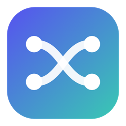

  
  <h1>CodexSwitch</h1>
  
<strong>계정은 바꾸고, 작업 흐름은 그대로.</strong>

  
여러 ChatGPT/Codex 계정과 사용량을 메뉴바에서 확인하고 바로 전환하세요.

  

    
    
    
  

<!--
실제 스크린샷을 준비하면 이 위치에 표시합니다.

  

-->

## 주요 기능

- **계정 전환** — 터미널을 열지 않고 저장된 계정을 바로 바꿉니다.
- **사용량 확인** — 현재 계정의 5시간·주간 사용량과 재설정까지 남은 시간을 보여줍니다.
- **자동 새로고침** — 켜면 메뉴를 닫아도 1분마다 현재 조회 설정으로 사용량을 갱신합니다. 기본값은 꺼짐이며 선택은 앱을 다시 실행해도 유지됩니다.
- **계정 관리** — 새 계정을 추가하고 이 Mac에 저장된 계정을 제거합니다.

## 설치

1. [최신 Release](https://github.com/heeeete/CodexSwitch/releases/latest)에서 Apple Silicon용 ZIP을 내려받습니다.
2. 압축을 풀고 `CodexSwitch.app`을 **응용 프로그램** 폴더로 옮깁니다.
3. 앱을 실행한 뒤 메뉴바의 CodexSwitch 아이콘을 누릅니다.

> [!NOTE]
> 배포 앱은 Apple Developer ID로 서명하고 Apple 공증을 마쳤습니다. CodexSwitch는 Dock 아이콘이나 일반 창이 나타나지 않는 메뉴바 앱입니다.

## 사용 환경

- macOS 14 이상
- Apple Silicon Mac
- 공식 Codex CLI 또는 공식 ChatGPT 데스크톱 앱 중 하나

`codex-auth`가 앱에 포함되어 있으므로 npm이나 `codex-auth`를 따로 설치할 필요는 없습니다. 계정 추가에는 Codex CLI 또는 ChatGPT 앱을 사용합니다.

## 사용 방법

1. Codex CLI나 ChatGPT에 이미 로그인했다면 기존 계정을 자동으로 가져옵니다.
2. 계정이 없다면 **계정 추가**를 눌러 브라우저에서 로그인합니다. 현재 계정과 실행 중인 ChatGPT는 그대로 유지됩니다.
3. 다른 계정으로 바꾸려면 **계정 변경**에 마우스를 올리고 오른쪽 목록에서 계정을 선택합니다.
4. 이 Mac에 저장된 계정을 지우려면 **계정 제거**에서 제거할 계정을 선택합니다.

계정 제거는 이 Mac의 Codex 인증정보만 지우며 실제 ChatGPT 계정을 삭제하지 않습니다.

## 사용량 조회

### 기본값 · 로컬 조회

로컬 Codex 세션에서 사용량을 읽습니다. 비공개 ChatGPT API를 호출하지 않지만, 비활성 계정의 값이 늦게 갱신될 수 있습니다.

### 선택 사항 · 실험적 API 조회

실험적 API 조회를 켜면 새로 고칠 때 `codex-auth`가 액세스 토큰으로 OpenAI의 비공개 ChatGPT 사용량·워크스페이스 엔드포인트를 호출합니다.

> [!WARNING]
> 이 과정에서 액세스 토큰이 로컬 Node 프로세스 인자에 잠시 전달될 수 있습니다. `codex-auth` 원본 프로젝트는 이 방식이 이용약관 위반으로 감지되어 계정 제한이나 정지로 이어질 가능성을 경고합니다. 이 기능은 기본적으로 꺼져 있습니다.

## 데이터와 계정

- 계정 스냅샷은 `~/.codex` 아래에 저장하며 별도 서버로 전송하지 않습니다.
- 계정을 변경하기 전에 기존 인증 파일을 로컬에 백업합니다.
- CodexSwitch에서 계정을 변경하거나 제거하는 동안 별도의 `codex-auth login`, `switch`, `remove` 명령을 동시에 실행하지 마세요.

## 오픈소스 및 고지

CodexSwitch에는 MIT 라이선스의 [`codex-auth`](https://github.com/Loongphy/codex-auth)가 포함되어 있습니다. 전체 출처와 라이선스는 [Third-party notices](THIRD_PARTY_NOTICES.md)에서 확인할 수 있습니다.

CodexSwitch 자체 소스에는 별도의 오픈소스 라이선스가 적용되지 않습니다. CodexSwitch는 OpenAI와 제휴하거나 OpenAI가 보증하는 공식 제품이 아니며, ChatGPT와 Codex는 각 권리자의 상표입니다.
